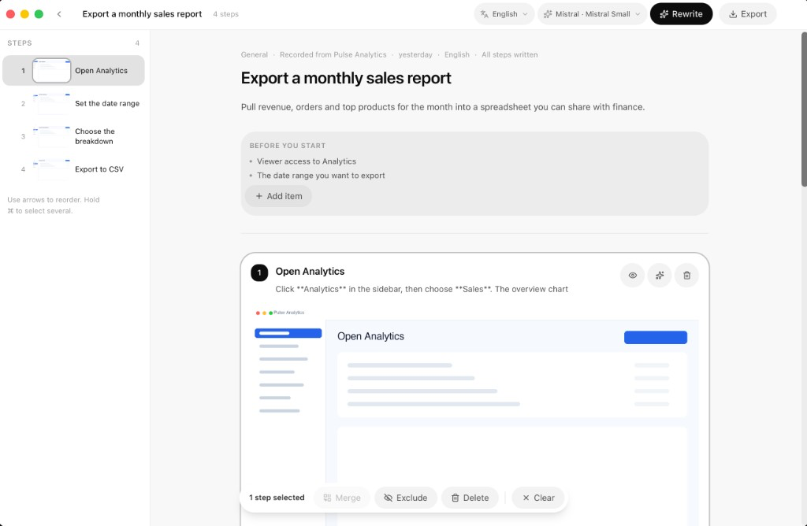

<p align="center">
  
</p>

<p align="center">
  <a href="LICENSE"></a>
</p>

# Steppy

Turn a workflow you do once into step-by-step documentation someone else can follow.

Steppy is a native desktop app. You pick a screen or window, do the task, and it captures each meaningful step with a screenshot. When you are ready, an AI model writes the instructions. Export as Markdown, a single HTML file, or PDF.

<p align="center">
  
</p>

**Website:** [steppy.app](https://steppy.app) · **Docs:** [steppy.app/docs](https://steppy.app/docs)  
**Download:** [Latest release](https://github.com/e-vicius/steppy/releases/latest)  
**Marketing site source:** [steppy-landing](https://github.com/e-vicius/steppy-landing)

## Download

| Platform | Install |
| --- | --- |
| **macOS** (Apple Silicon) | [`.dmg` aarch64](https://github.com/e-vicius/steppy/releases/latest/download/Steppy_0.1.1_aarch64.dmg) |
| **macOS** (Intel) | [`.dmg` x64](https://github.com/e-vicius/steppy/releases/latest/download/Steppy_0.1.1_x64.dmg) |
| **Windows** (x64) | [`.exe` installer](https://github.com/e-vicius/steppy/releases/latest/download/Steppy_0.1.1_x64-setup.exe) |
| **Windows** (ARM64) | [`.exe` installer](https://github.com/e-vicius/steppy/releases/latest/download/Steppy_0.1.1_arm64-setup.exe) |
| **Linux** | [AppImage](https://github.com/e-vicius/steppy/releases/latest/download/Steppy_0.1.1_amd64.AppImage) · [`.deb`](https://github.com/e-vicius/steppy/releases/latest/download/steppy_0.1.1_amd64.deb) |

Asset names match tag `v0.1.1`. See [all releases](https://github.com/e-vicius/steppy/releases) if a newer version is available.

Requires macOS 11+, Windows 10+, or a recent Linux desktop with screen capture.

## Open source vs Cloud

| | **Steppy (this repo)** | **Steppy Cloud** |
| --- | --- | --- |
| Price | Free, MIT licence | $7/month |
| AI models | Local (Ollama, LM Studio) or bring your own cloud keys | We run the models for you |
| Usage limits | Your provider's limits | Unlimited writing in the app |
| Accounts | None | Sign in inside the app |
| Extra features | Community driven | Sharable links and more shipping soon |

Enterprise teams: [contact us](mailto:hello@steppy.app).

## How it works

1. **Record** — Steppy samples the screen, detects meaningful changes, and saves a frame per step. You can mark moments by hand.
2. **Review** — Reorder, merge, blur sensitive areas, swap frames, edit titles.
3. **Write** — Your chosen model turns screenshots into instructions. Steps you edited yourself are left alone. [How AI writing works →](docs/ai-writing.md)
4. **Export** — Markdown (+ images folder), self-contained HTML, or print-ready PDF.

## Privacy

Recording, editing, and export stay on your machine. Cloud is opt-in only: local models keep writing on your hardware, or you connect Steppy Cloud or your own API keys. [Full privacy guide →](docs/privacy.md)

## Documentation

Full guides at [steppy.app/docs](https://steppy.app/docs) or in [`docs/`](docs/README.md).

**Using Steppy:** [Getting started](docs/getting-started.md) · [Recording](docs/recording.md) · [Editing](docs/editing.md) · [Settings](docs/settings.md) · [AI writing](docs/ai-writing.md) · [Local models](docs/local-models.md) · [Export](docs/export.md) · [Shortcuts](docs/keyboard-shortcuts.md) · [Troubleshooting](docs/troubleshooting.md) · [Privacy](docs/privacy.md)

**Developers:** [Build from source](docs/build-from-source.md) · [Architecture](docs/architecture.md) · [Contributing](CONTRIBUTING.md)

## Build from source

```bash
git clone https://github.com/e-vicius/steppy.git
cd steppy
pnpm install
pnpm tauri dev      # development
pnpm tauri build    # installers in src-tauri/target/release/bundle/
```

See [docs/build-from-source.md](docs/build-from-source.md) and [CONTRIBUTING.md](CONTRIBUTING.md).

## Licence

MIT. See [LICENSE](LICENSE).
